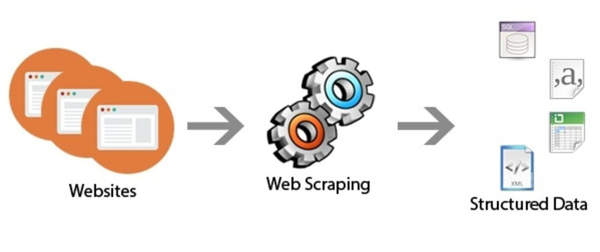

# Webscrapping
## Scrapping-Flipkart

Here I am scrapping flipkart to get the data of all the smartphones it has on sale.

Iterated through 15 pages of the website and extracted the details like Name, Ram, Rom, Ratings and Prices of all the smartphones and finally extracted out the data of those smartphones which had a RAM higher than 6 GB.

The notebook is self explanatory and anyone with some python knowledge will be able to easily implement it.
